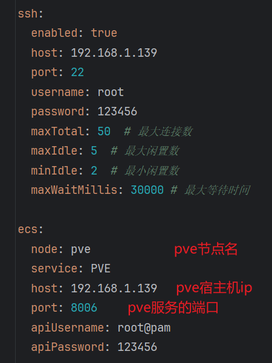

# virtu-ease

#### 介绍
虚拟化平台,用于对接不同的虚拟化服务,作为一个中间层,封装虚拟化服务提供者的api,命令行

#### 软件架构
软件架构说明

#### 安装教程

1.  springboot 3.3.5
2.  pve 8.3-1

#### 使用说明

1.  需要先有一个虚拟化服务的提供者,本系统默认集成了proxmox ve,官网:https://www.proxmox.com/en/
2.  pve版本: 8.3-1
3.  配置文件

#### 参与贡献
1. 项目架构参考ruo-vue-plus: https://gitee.com/dromara/RuoYi-Vue-Plus

#### 作者联系方式
1. 微信: WE1473601995
2. 邮箱: 1473601995@qq.com

